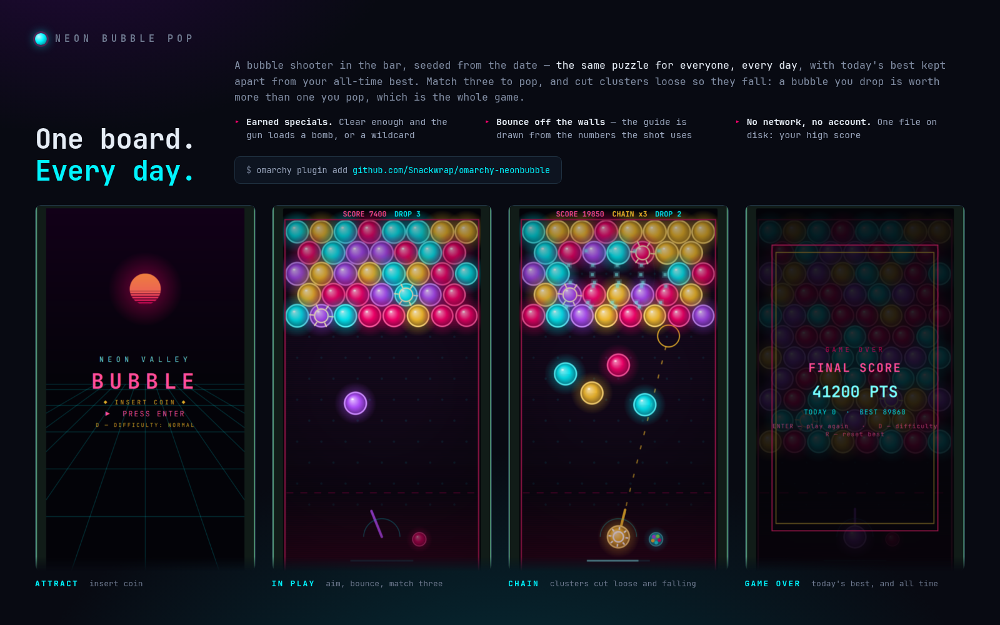

# Neon Bubble Pop — Omarchy bar plugin



A neon bubble shooter in the [Omarchy](https://omarchy.org) bar, with a **daily
board**: everyone gets the same puzzle each day, and a score to beat on it.

Click the **NB** pill to open the board. Middle-click resets to the menu.

## Controls

| Input | Action |
|-------|--------|
| **← →** | Aim (hold) |
| **SPACE** | Fire |
| **ENTER** | Start game / play again |
| **D** | Cycle difficulty (menu or game over) |
| **R** | Reset high-score tracker (menu or game over) |
| **ESC** | Close |

## How it plays

Match **three or more** touching bubbles of a colour and they pop. Anything the
popped cluster was holding up is no longer attached to the ceiling, so it comes
loose and falls — and a bubble you drop is worth more than one you pop, which is
the whole game. Aim at the walls: the shot reflects off them, and the useful
shots are usually the ones that go round something rather than at it.

Every **six shots** the ceiling comes down a row. Let the board reach the dashed
line and it is over.

**Specials are earned, not dealt.** Every eleven bubbles you take off the board
fills the meter under the gun, and the next bubble loaded is either a **bomb**,
which clears everything it touches whatever the colour, or a **wildcard**, which
becomes the colour that makes the biggest cluster where it lands. That is the
colour that makes the biggest *cluster*, not the one it touches most of — a
wildcard beside one bubble of a colour that is part of a run of six should join
the six.

**Stars** are worth 900 and marked with a turning ring. Two sit on the opening
board, and the ceiling brings more down. They arrive at the top, which is the
one part of the board that otherwise gives you no reason to shoot.

The colour in the gun is only ever one still on the board, so a shot is never
wasted on a colour that cannot match.

## The daily board

By default the board is seeded from the date: the same puzzle for everybody,
every day, with today's best tracked separately from your all-time best. It is
a bar widget — you open it for a minute at a time — so a puzzle that resets
daily suits it better than an endless one.

Set `boardMode` to `random` for a fresh board every game.

## Difficulty

Three settings, and the only thing they change is **how fast the ceiling comes
down**. The board is identical on all three — the daily puzzle has to be the
same puzzle for everybody, or comparing scores on it stops meaning anything.

| | Ceiling drops every | Tightening to | One shot faster every |
|---|---|---|---|
| Easy | 8 shots | 5 | 16 shots |
| Normal | 6 shots | 3 | 10 shots |
| Hard | 4 shots | 2 | 7 shots |

The cadence used to be a flat six for a whole run, so the game never got harder
— a player who survived the first minute had solved it and the rest was
arithmetic. Now it tightens as you fire, down to a floor it never passes. The
floor is what stops the ramp becoming a brick wall: below it there is no room
left to build a cluster before the ceiling moves again.

Measured over 120 games each with `tools/sim.mjs`:

```
easy    24.3 shots/game   2.9 ceiling descents
normal  20.5 shots/game   3.6 ceiling descents
hard    15.7 shots/game   4.8 ceiling descents
```

**Bests are kept per difficulty**, because a score is only comparable against
another played on the same curve. `D` cycles it for the session; `difficulty`
in the settings is the persistent choice. A score file written before difficulty
existed migrates into `normal`, which is where the old fixed cadence started.

## What is checked, and against what

`GameEngine.js` has no Qt types in it, so `tools/sim.mjs` runs the whole game
under node — 300 games, thousands of shots — and asserts on the outcomes rather
than on how it looks:

```bash
node tools/sim.mjs            # 300 games, summary
node tools/sim.mjs --check    # assertions, non-zero exit on failure
```

The invariants are the ones a bubble shooter lives or dies by, and each is
checked after **every shot** rather than at the end, because one bad resolve is
enough to see:

- **No bubble is ever left hanging off nothing.** Every bubble on the board must
  be reachable from the top row.
- **No unmatchable colour is ever dealt** — a bubble of a colour no longer on
  the board is a wasted shot that still brings the ceiling down.
- **A board past the line always ends the game**, rather than growing quietly
  off the bottom.
- **The hex grid is consistent**: at both board parities, every neighbour
  relation is mutual, every neighbour is exactly one bubble away, and no cell
  sits outside the walls. A staggered grid gets this wrong the moment a row
  offset changes sign, and the symptom is clusters that fail to match along one
  diagonal only.
- **The ceiling drop carries every row down intact.** The board's parity flips
  with the shift so each row keeps its length and alignment — checked by
  actually dropping a filled board, because the arithmetic version of that test
  was wrong while the code was right.
- **The daily board is a function of the date**: the same day repeats exactly,
  adjacent days differ, and no daily board holds a colour fewer than three
  times — a colour you cannot ever clear is not a puzzle.
- **The aim guide describes the path the shot takes**, drawn from the same
  numbers, so it cannot promise a bounce the bubble will not make.
- **A bomb drops what it cut loose**, the same as a pop does — it takes a
  different path through the code, so it is checked separately.
- **A wildcard resolves to a colour that exists**, and joins the largest cluster
  available rather than the first neighbour it looked at.
- **The star grid stays the same shape and length as the board** through every
  descent. Shifting one without the other keeps the alignment correct and grows
  the array forever, which nothing else would notice.
- **Both earned features are actually reachable.** Random play has to fire
  specials and collect stars, or they are decoration: stars used to come back
  once in three hundred games, because they only ever entered at the top row
  and nobody clears the top. Two on the opening board took that to 118.

## Requirements

- Omarchy **Quattro (v4)** with `omarchy-shell`
- `paplay` on `PATH` for sound (optional)
- `perl` for the high-score file (Omarchy depends on it)

## Install

```bash
omarchy plugin add https://github.com/Snackwrap/omarchy-neonbubble.git --enable
omarchy bar move com.leafbox.neonbubble right
```

## Uninstall

```bash
omarchy plugin disable com.leafbox.neonbubble
omarchy plugin remove com.leafbox.neonbubble
omarchy restart shell
```

## Settings

```bash
omarchy bar set com.leafbox.neonbubble boardMode random
omarchy restart shell
```

| Setting | Key | Default |
|---------|-----|---------|
| Sound effects | `sound` | `true` |
| Board | `boardMode` | `daily` — or `random` |
| Difficulty | `difficulty` | `normal` — or `easy`, `hard` |
| Popup position | `popupPosition` | `icon` |
| Freeze a scene for a screenshot | `debugPreviewScene` | `off` |
| Print the popup's own frame to the journal | `debugGeometry` | `false` |

The last two exist for `tools/capture-preview.sh` and are not much use
otherwise.

## Files and processes

The high score is the only thing written to disk, and the only reason this
plugin starts a process at all besides `paplay`. It holds five integers, in
`~/.local/state/omarchy/plugins/com.leafbox.neonbubble/scores.json`:

- Neither helper takes a path: each derives the one it is allowed to use from
  `$HOME` and the plugin id.
- **The directory walk is descriptor-relative.** Every component from `$HOME`
  down is opened `O_DIRECTORY | O_NOFOLLOW` and validated by `fstat` on *that
  descriptor*, and the next is opened through it as `/proc/self/fd/N/<name>`,
  which the kernel resolves to the inode the descriptor holds rather than
  re-walking the path. The temporary file and the rename that publishes it go
  through the same descriptor, so an ancestor can be neither a symlink nor
  swapped after the check. Checking with a pathname `stat` and then opening by
  pathname validates one set of directories and writes through another.
- The leaf is created `O_CREAT | O_EXCL | O_NOFOLLOW` at 0600 and renamed into
  place, and nothing reopens it by pathname afterwards. The reader opens it
  `O_RDONLY | O_NOFOLLOW | O_NONBLOCK` and checks through the descriptor that it
  is a regular file we own, with no extra links, not group- or world-writable,
  and small.
- **No process here has a child.** The deadline lives inside perl as an `alarm`
  rather than in a `timeout` wrapper, and `paplay` is started directly, so every
  process the plugin spawns is a single executable that Quickshell owns and
  reaps. A save arriving while one is in flight is queued and started from
  `onExited`, because setting `running = false` does not reap the child.
- The daily best is stamped with the day it belongs to, so a stale file cannot
  claim today's score.

Nothing here touches the network.

## License

MIT.
